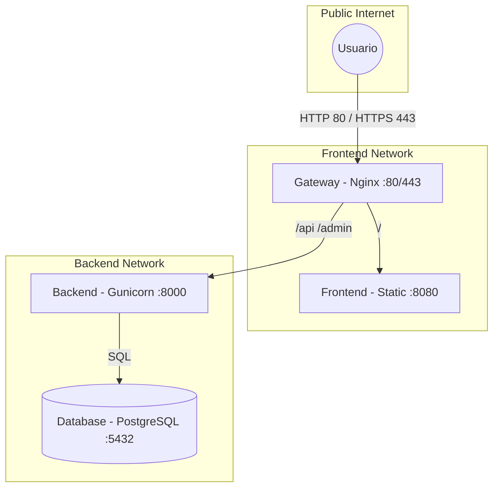

# technical blueprint - 3-tier-app

## arquitectura de red y flujo de trafico
el sistema utiliza un esquema de proxy inverso para centralizar el trafico, manejar el cifrado ssl/tls y aislar los servicios internos mediante redes virtuales de docker.

## desglose de componentes

| componente | responsabilidad tecnica | comunicacion |
| :--- | :--- | :--- |
| frontend | gestion de interfaz y estado global (redux). | fqdn (https) |
| backend | logica de negocio y autenticacion jwt. | puerto 8000 |
| database | persistencia de datos relacionales (volumen persistente). | puerto 5432 |
| nginx-proxy | terminacion ssl/tls y ruteo de peticiones. | puertos 80, 443 |

## infraestructura y despliegue
el proyecto utiliza una arquitectura de microservicios orquestada con docker compose, y preparado para  integracion continua y despliegue continuo con github actions.

- **orquestacion:** el archivo `docker-compose.yml` centraliza la gestion de todos los servicios. las imagenes se construyen y almacenan en el github container registry (ghcr.io).
- **automatizacion de ci/cd:** se utiliza un flujo de trabajo en github actions (`main.yml`) que automatiza:
    - construccion de imagenes multi-stage.
    - push a ghcr.io con etiquetado automatico.
    - despliegue remoto runners self-hosted mediante docker compose.
- **gestion de configuracion:** el sistema emplea una arquitectura basada en variables de entorno. los valores sensibles (credenciales de db, secret_key de django) se gestionan mediante github secrets e interoperan con el archivo `docker-compose.yml` mediante interpolacion de shell.
- **proxy reverso y ssl:** se utiliza un contenedor dedicado con nginx que gestiona certificados ssl mediante inyeccion en tiempo de ejecucion (certs/keys) desde variables de entorno, permitiendo una rotacion de certificados sin modificar la imagen.

## vision operativa
- **monitoreo:** los logs de todos los servicios estan centralizados en el flujo de salida de docker compose. el backend incluye un script `entrypoint.sh` para validacion de salud de la base de datos previo al inicio.
- **puntos de control:**
    - despliegue totalmente contenerizado e inmutable.
    - aislamiento estricto: la base de datos solo es visible para el backend en la red `backend_net`.
    - el frontend se pre-configura en tiempo de compilacion (build-args) para apuntar al fqdn correcto de la api.

## seguridad y cumplimiento
- **tls/ssl:** trafico cifrado de extremo a extremo para el usuario final.
- **gestion de secretos:** no se almacenan credenciales en el codigo fuente. se requiere un archivo `.env` para ejecuciones locales o la configuracion de secrets en el repositorio para despliegues automatizados.
- **limpieza automatica:** el flujo de ci/cd incluye pasos de limpieza de imagenes huerfanas para optimizar el almacenamiento en el nodo de despliegue.

## deuda tecnica y mejoras prioritarias
- **pruebas automatizadas:** integrar la ejecucion de `pytest` dentro del pipeline de ci antes de la fase de construccion.
- **alta disponibilidad:** evaluar la migracion hacia un orquestador de contenedores (kubernetes) para escalabilidad horizontal.
- **monitoreo avanzado:** implementar una stack de observabilidad (prometheus/grafana) para el seguimiento de metricas de los contenedores.
