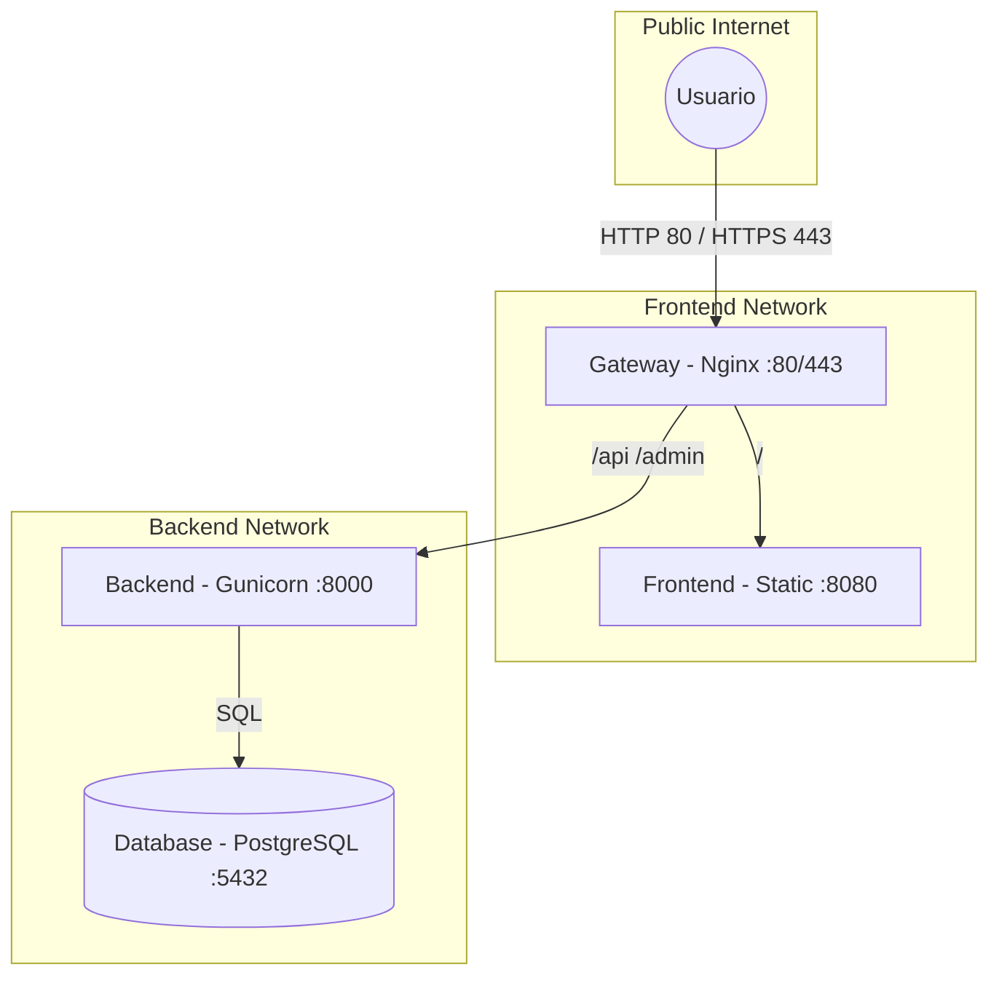

# technical blueprint - proyecto craftech

## arquitectura de red y flujo de trafico
el sistema utiliza un esquema de proxy inverso para centralizar el trafico, manejar el cifrado ssl/tls y aislar los servicios internos.

## desglose de componentes

| componente | responsabilidad tecnica | comunicacion |
| :--- | :--- | :--- |
| frontend | gestion de interfaz y estado global (redux). | fqdn (https) |
| backend | logica de negocio y autenticacion jwt. | orm puerto 5432 |
| database | persistencia de datos relacionales. | puerto 5432 |

## infraestructura y despliegue
el proyecto utiliza una arquitectura de microservicios orquestada con docker compose, optimizada para entornos de produccion y demostraciones publicas.

- **orquestacion:** el archivo `docker-compose.yml` centraliza la gestion de la base de datos (postgresql), el backend (django/gunicorn), el frontend (react/nginx) y el proxy reverso (nginx).
- **proxy reverso y ssl:** se implemento un gateway con nginx que gestiona la terminacion tls utilizando certificados ssl validos vinculados a un nombre de dominio (fqdn).
- **provisionamiento:** el backend cuenta con un script `entrypoint.sh` que asegura la disponibilidad de la base de datos, aplica migraciones y carga datos iniciales de prueba.
- **variables de entorno:** el sistema utiliza archivos `.env` para la inyeccion dinamica de configuraciones, permitiendo cambiar el fqdn y las urls de api sin modificar el codigo fuente.

## vision operativa
- **monitoreo:** los logs de todos los servicios estan centralizados en el flujo de salida de docker compose y se persisten logs especificos del proxy en el sistema de archivos del host.
- **puntos de control:**
    - despliegue totalmente contenerizado.
    - servidor wsgi (gunicorn) para el backend.
    - servidor web ligero (nginx) para servir el bundle estatico del frontend.
    - redireccion automatica de http a https.

## seguridad y cumplimiento
- **tls/ssl:** trafico cifrado de extremo a extremo para el usuario final mediante certificados reconocidos por navegadores.
- **aislamiento de red:** el backend y la base de datos operan en una red interna (`backend_net`), mientras que solo el proxy y el frontend son accesibles via `frontend_net`.
- **autenticacion:** gestion de sesiones mediante jwt y autenticacion personalizada.

## deuda tecnica y mejoras prioritarias
- **restauracion de infraestructura:** reconstruir los `Dockerfile` eliminados y reintegrar los servicios al `docker-compose.yml`.
    - **backend:** utilizar la imagen base python:3.8.3-alpine con dependencias de postgresql.
    - **frontend:** implementar un multi-stage build para generar el estatico y servirlo con nginx.
- **automatizacion de ci/cd:** definir flujos de trabajo en github actions para validacion de tests (pytest) y construccion de imagenes.
- **gestion de configuracion:** migrar secretos a variables de entorno (`.env` no trackeado) o un vault.
- **optimizacion de red:** implementar un proxy inverso para unificar el punto de entrada y manejar cors de forma centralizada.
