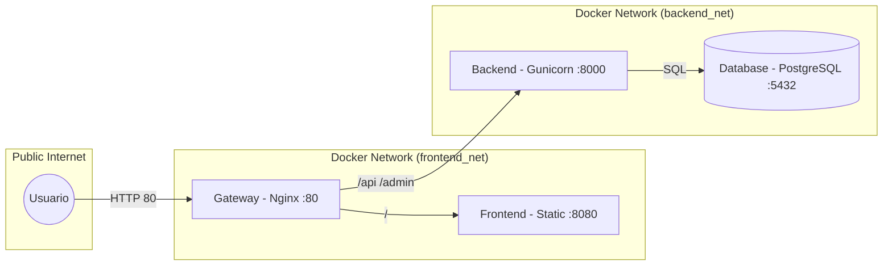

# technical blueprint - proyecto craftech

## arquitectura de red y flujo de trafico
el sistema utiliza un esquema de proxy inverso para centralizar el trafico y aislar los servicios internos.

## desglose de componentes

| componente | responsabilidad tecnica | comunicacion |
| :--- | :--- | :--- |
| frontend | gestion de interfaz y estado global (redux). | axios puerto 8000 |
| backend | logica de negocio y autenticacion jwt. | orm puerto 5432 |
| database | persistencia de datos relacionales. | puerto 5432 |

## infraestructura y despliegue
segun el analisis de los metadatos de git (revisión de commits previos), el proyecto contaba originalmente con una arquitectura de contenedores completa que fue parcialmente degradada.
- **estado original (recuperado):** existian `Dockerfile` dedicados para frontend (basado en node:17-alpine) y backend (basado en python:3.8.3-alpine).
- **estado actual:** solo se mantiene el servicio de base de datos en `docker-compose.yml`. el servicio `api` fue removido del manifiesto de orquestacion.
- **provisionamiento:** el archivo `entrypoint.sh` en el backend gestiona la espera de la base de datos (netcat), migraciones y carga de datos iniciales (`initial_data.json`).
- **pipelines:** no se detecta automatizacion de ci/cd activa, aunque la estructura original sugiere una intencion de despliegue contenerizado.

## vision operativa
- **monitoreo:** ausencia de herramientas de telemetria. los logs son efimeros y locales.
- **puntos criticos:**
    - degradacion de la infraestructura de contenedores (manualizacion del inicio de servicios).
    - dependencia de `runserver` de django en lugar de un servidor wsgi de grado productivo (gunicorn).
    - el frontend requiere un servidor web (nginx) para servir los archivos estaticos generados por `npm run build`.

## seguridad y cumplimiento
- **secretos:** exposicion de `SECRET_KEY` y credenciales de base de datos en archivos de texto plano y metadatos historicos.
- **entorno:** configuracion de `DEBUG = 1` y `ALLOWED_HOSTS = "*"` detectada en configuraciones activas.
- **autenticacion:** implementacion de jwt con backend personalizado (`ActiveSessionAuthentication`).

## deuda tecnica y mejoras prioritarias
- **restauracion de infraestructura:** reconstruir los `Dockerfile` eliminados y reintegrar los servicios al `docker-compose.yml`.
    - **backend:** utilizar la imagen base python:3.8.3-alpine con dependencias de postgresql.
    - **frontend:** implementar un multi-stage build para generar el estatico y servirlo con nginx.
- **automatizacion de ci/cd:** definir flujos de trabajo en github actions para validacion de tests (pytest) y construccion de imagenes.
- **gestion de configuracion:** migrar secretos a variables de entorno (`.env` no trackeado) o un vault.
- **optimizacion de red:** implementar un proxy inverso para unificar el punto de entrada y manejar cors de forma centralizada.
